# OpenClaw 伺服器架設手冊

> 這是一份完整的 OpenClaw Discord 機器人架設指南，帶你一步步完成從安裝到上線的全部流程。

## 📋 目錄

- [系統需求](#系統需求)
- [前置準備](#前置準備)
- [安裝步驟](#安裝步驟)
- [基礎設定](#基礎設定)
- [Discord 機器人配置](#discord-機器人配置)
- [技能與 API 配置](#技能與-api-配置)
- [Gateway 服務設定](#gateway-服務設定)
- [啟動與測試](#啟動與測試)
- [常見問題](#常見問題)

---

## 系統需求

在開始之前，請確保你的系統符合以下要求：

- **作業系統**: Windows 10/11, macOS, 或 Linux
- **Node.js**: 14.0 或更高版本
- **記憶體**: 至少 2GB RAM
- **網路**: 穩定的網際網路連線
- **Discord 帳號**: 用於創建機器人

---

## 前置準備

### 步驟 1: 下載並安裝 Node.js

首先，你需要安裝 Node.js 環境。

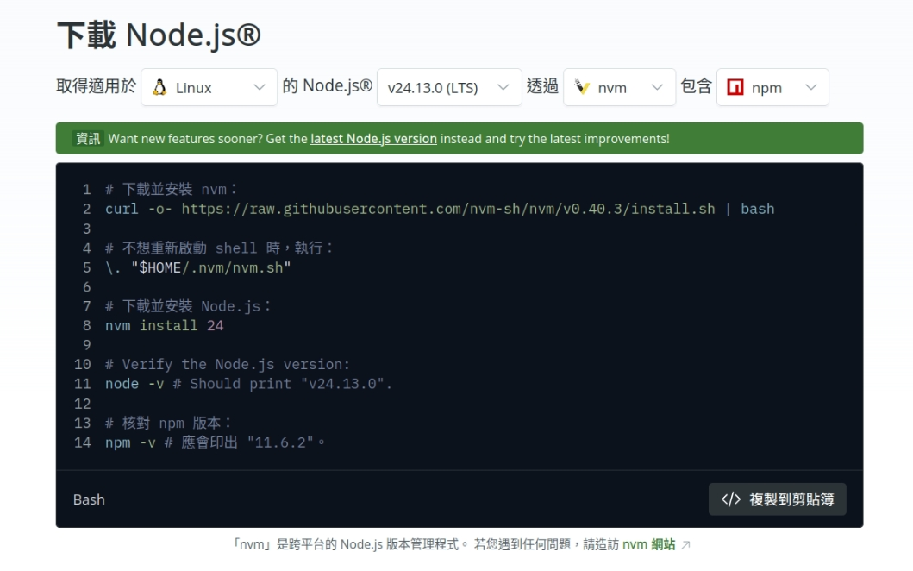

1. 前往 [Node.js 官方網站](https://nodejs.org/)
2. 下載適合你作業系統的 LTS 版本
3. 執行安裝程式並依照指示完成安裝
4. 安裝完成後，開啟終端機/命令提示字元，輸入 `node --version` 確認安裝成功

---

## 安裝步驟

### 步驟 2: 安裝 OpenClaw

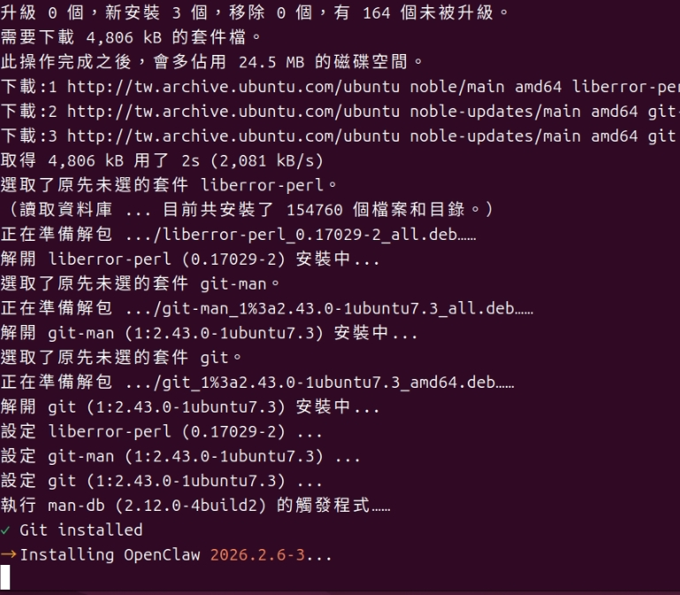

使用 npm 全域安裝 OpenClaw：

```bash
npm install -g openclaw
```

等待安裝完成後，執行以下指令啟動設定程序：

```bash
openclaw init
```

---

## 基礎設定

### 步驟 3: 回答初始化問題

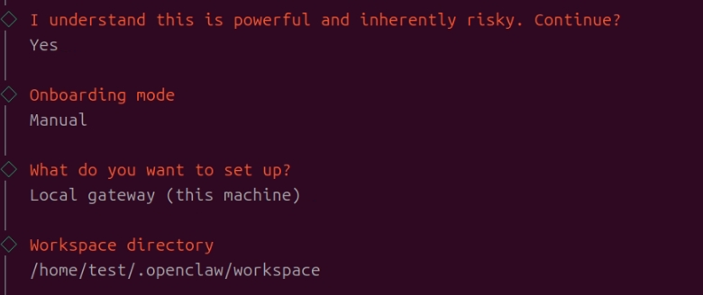

在初始化過程中，OpenClaw 會詢問一些基本問題，請依照你的需求回答。

### 步驟 4: 選擇 AI 模型

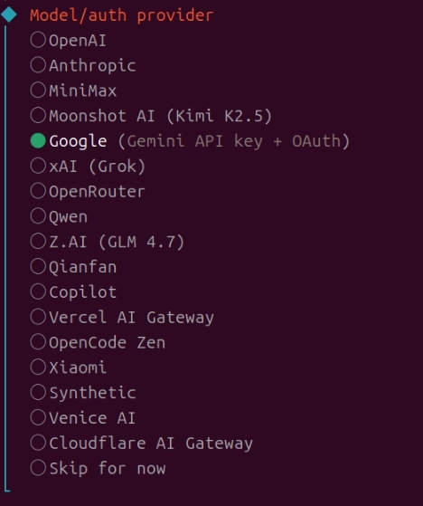

選擇你想要使用的 AI 模型。OpenClaw 支援多種模型，包括：

- GPT-3.5
- GPT-4
- Claude
- 其他本地模型

### 步驟 5: 設定驗證方式

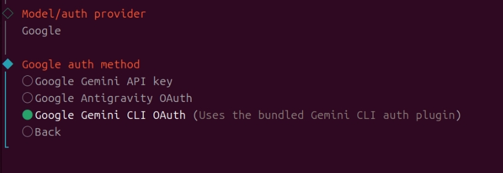

選擇適合的驗證方式來保護你的機器人。

### 步驟 6: 設定預設模型

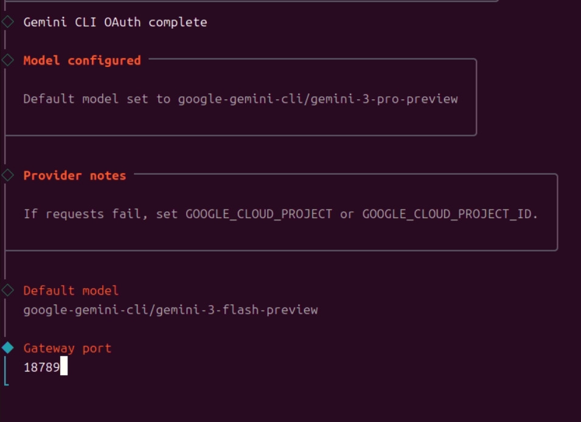

設定機器人的預設對話模型，這將用於一般的對話互動。

### 步驟 7: Gateway 埠號綁定


設定 Gateway 服務要使用的埠號，預設為 `8080`。如果該埠號已被佔用，請選擇其他可用的埠號。

---

## Discord 機器人配置

### 步驟 8: 取得 Gateway Token

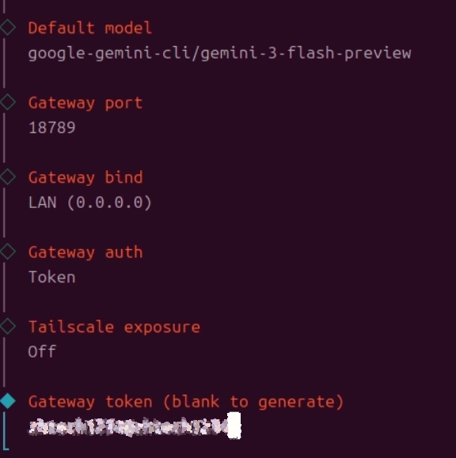

系統會為你生成一組 Gateway Token，請妥善保管這個 Token。

### 步驟 9: 設定聊天配置

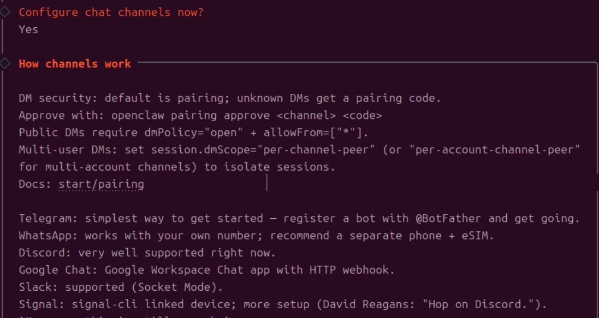

配置機器人的聊天功能設定，包括：

- 回應模式
- 觸發關鍵字
- 訊息格式

### 步驟 10: 輸入 Discord Bot Token

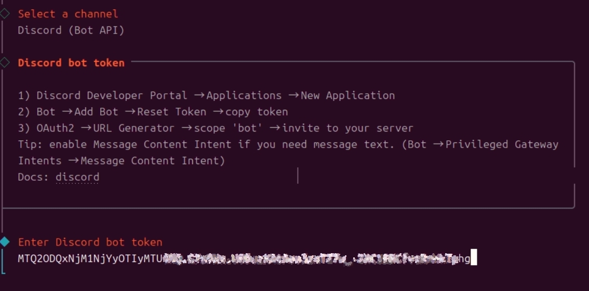

前往 [Discord Developer Portal](https://discord.com/developers/applications) 創建一個新的機器人應用程式：

1. 點擊「New Application」
2. 為你的機器人命名
3. 進入「Bot」頁面
4. 點擊「Add Bot」
5. 複製 Bot Token 並貼上到 OpenClaw 設定中

### 步驟 11: 設定 Discord 頻道存取權限

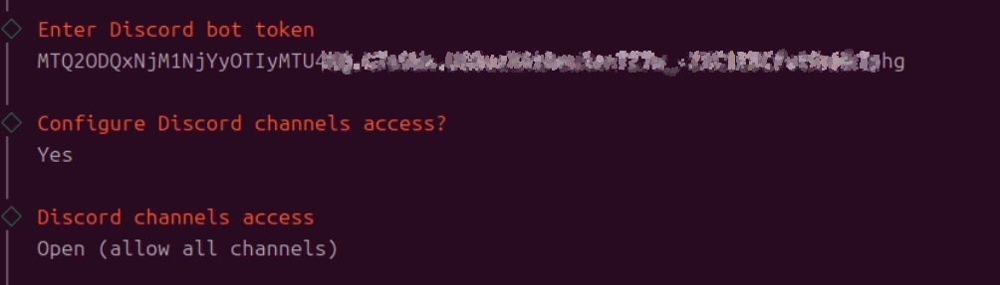

配置機器人可以存取的 Discord 頻道。你可以：

- 設定特定頻道讓機器人運作
- 配置頻道白名單/黑名單
- 調整權限範圍

### 步驟 12: Discord 配對核准

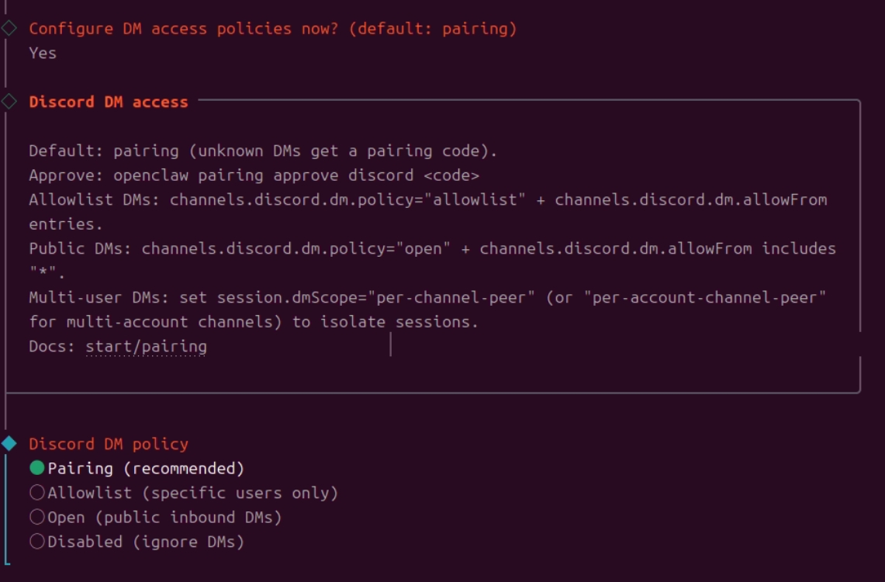

完成 Discord 機器人的配對流程，系統會請求必要的權限核准。

---

## 技能與 API 配置

### 步驟 13: 配置技能設定

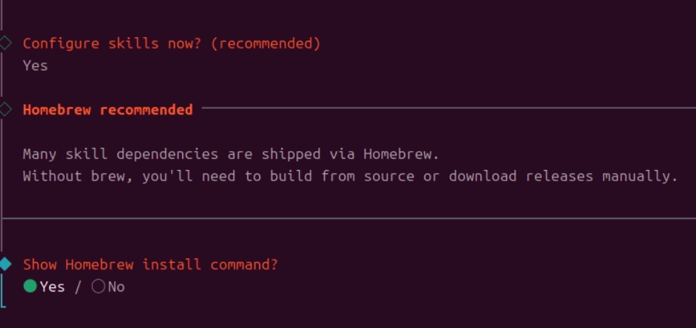

OpenClaw 支援多種技能擴充功能。在這個步驟中，你可以：

- 查看可用的技能列表
- 啟用/停用特定技能
- 配置技能參數

### 步驟 14: 安裝技能

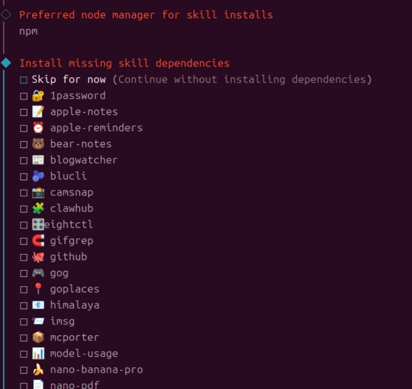

選擇你需要的技能並進行安裝。常見的技能包括：

- 圖片生成
- 網頁搜尋
- 天氣查詢
- 音樂播放

### 步驟 15: 配置其他 API Keys


如果你的技能需要額外的 API 服務，請在此輸入相關的 API Keys：

- OpenAI API Key
- Google Search API Key
- Weather API Key
- 其他第三方服務 Keys

---

## Gateway 服務設定

### 步驟 16: 安裝 Gateway 服務

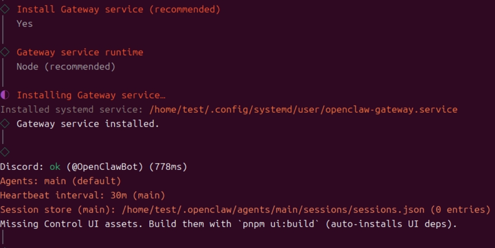

安裝 OpenClaw Gateway 服務，這個服務負責處理機器人與外部系統的通訊。

### 步驟 17: 取得 WebUI 地址

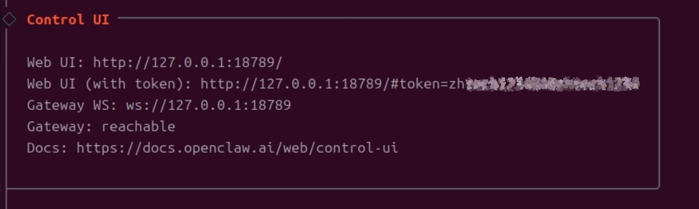

完成安裝後，系統會提供 WebUI 管理介面的存取地址。透過 WebUI，你可以：

- 監控機器人狀態
- 調整即時設定
- 查看運行日誌
- 管理使用者權限

### 步驟 18: 設定 Gateway Token

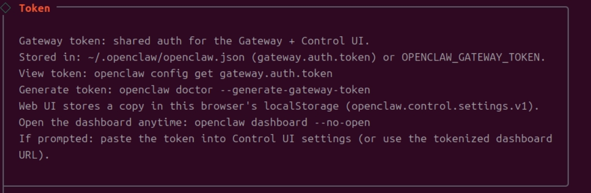

在 Gateway 服務中設定先前取得的 Gateway Token。

### 步驟 19: 孵化機器人

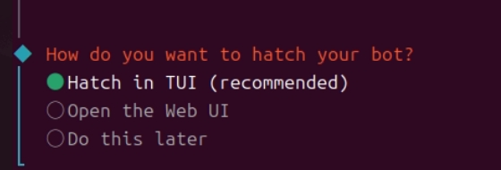

使用「孵化」功能啟動你的機器人實例。

### 步驟 20: 處理離線狀態

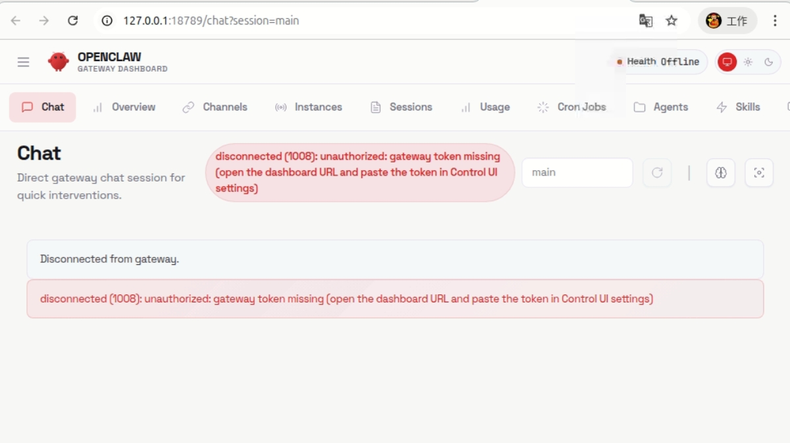

如果機器人顯示離線狀態，請檢查：

- 網路連線是否正常
- Bot Token 是否正確
- Discord 機器人權限是否設定完整

### 步驟 21: 確認 Gateway Token 設定

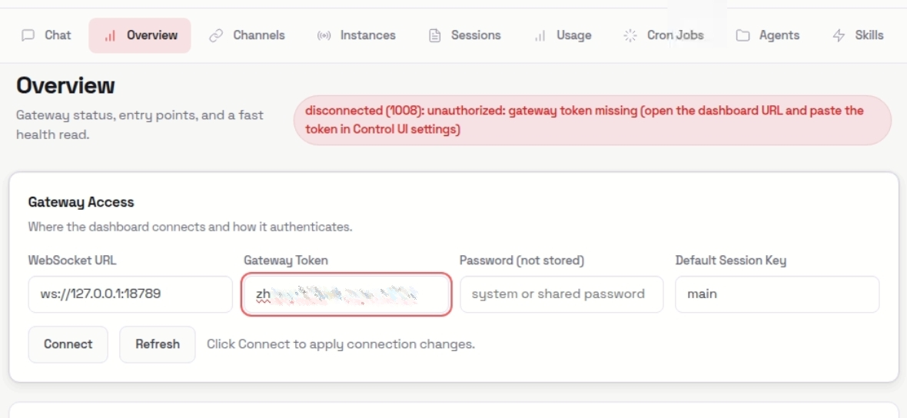

再次確認 Gateway Token 已正確設定。

### 步驟 22: Gateway 連線成功

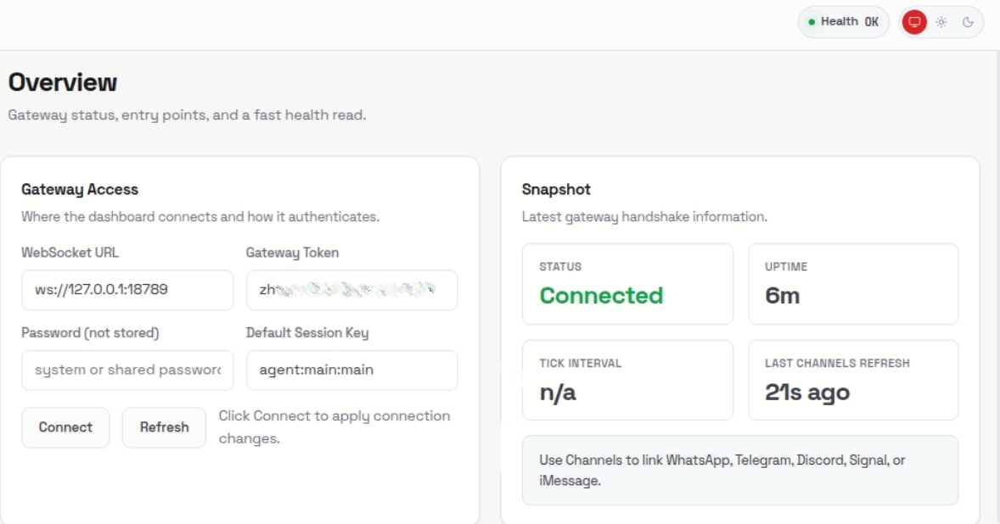

當所有設定正確時，Gateway 會成功連線，你會看到連線成功的訊息。

### 步驟 23: 核准新使用者

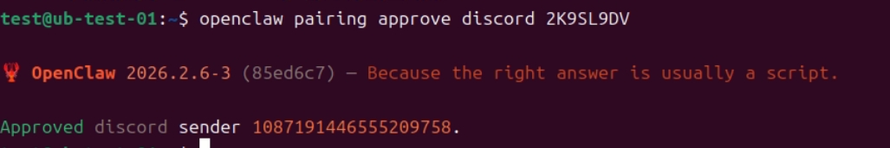

當有新使用者想要使用機器人時，你需要透過管理介面進行核准。

---

## 啟動與測試

### 啟動 Gateway 服務

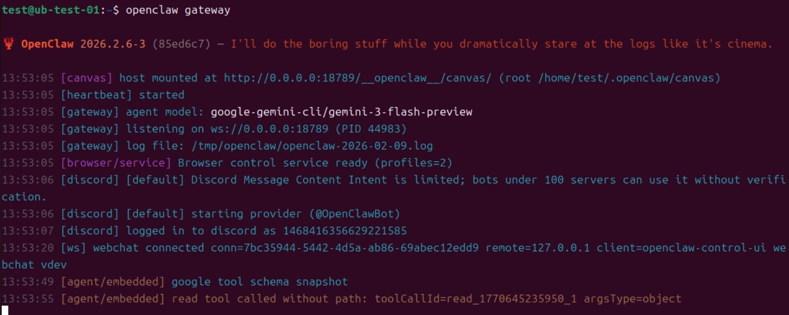

使用以下指令啟動 Gateway 服務：

```bash
openclaw gateway start
```

### 停止 Gateway 服務

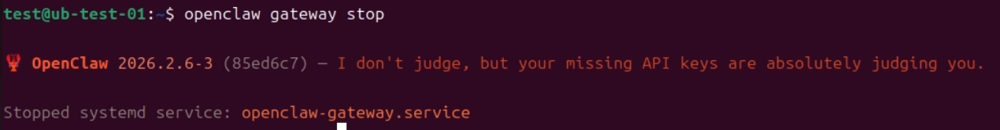

需要維護時，可以使用以下指令停止服務：

```bash
openclaw gateway stop
```

### 測試機器人功能

1. 在 Discord 中找到你的機器人
2. 傳送測試訊息確認機器人回應
3. 測試各項技能功能
4. 確認權限設定正確

---

## 常見問題

### Q: 機器人無法回應訊息？

**A:** 請檢查以下項目：
- Bot Token 是否正確
- 機器人是否有頻道的讀取/傳送訊息權限
- Gateway 服務是否正常運行
- 網路連線是否穩定

### Q: 如何更新 OpenClaw？

**A:** 使用以下指令：
```bash
npm update -g openclaw
```

### Q: 可以在同一台機器上運行多個機器人嗎？

**A:** 可以！只需要使用不同的埠號和設定檔案即可。

### Q: API Key 應該如何保管？

**A:**
- 永遠不要把 API Keys 提交到 Git 儲存庫
- 使用環境變數存儲敏感資訊
- 定期更換 Keys 以確保安全

### Q: 忘記 Gateway Token 怎麼辦？

**A:** 可以透過以下指令重新生成：
```bash
openclaw gateway reset-token
```

---

## 🎉 完成！

恭喜你完成 OpenClaw 的架設！現在你的 Discord 機器人已經可以開始服務了。

如需更多協助，請參考：
- [OpenClaw 官方文件](https://openclaw.org)
- [Discord 社群頻道](https://discord.gg/openclaw)
- [GitHub Issues](https://github.com/openclaw/openclaw/issues)

---

**祝你使用愉快！** 🚀